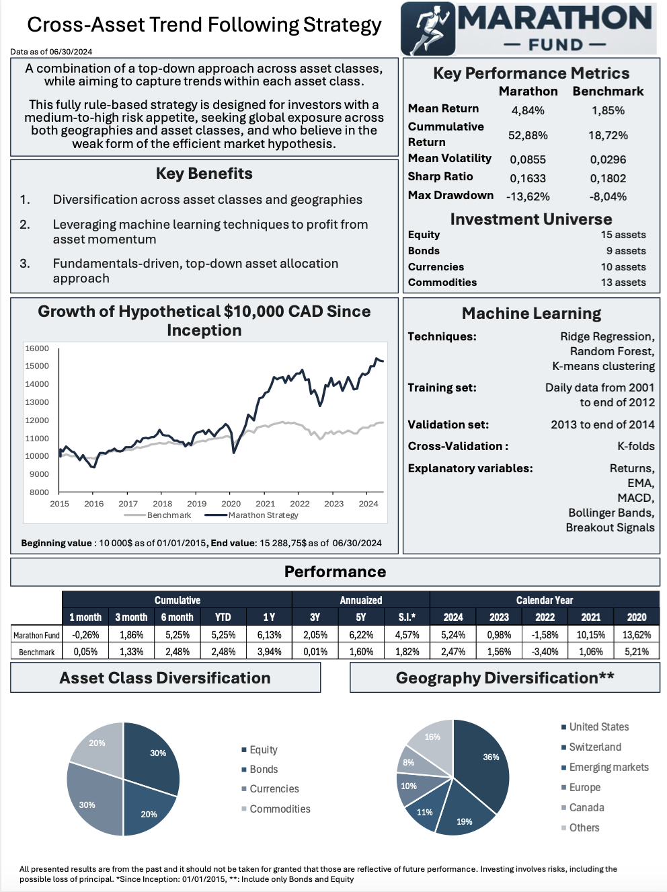

# Investor Overview 

## Fund Profile ❗️

* Our fund seeks to deliver robust, risk-adjusted returns through a highly diversified portfolio spanning multiple asset classes and geographies.
  
* By leveraging advanced machine learning techniques, we identify and capitalize on asset momentum trends, enhancing our ability to capture growth opportunities.

* At the core of our strategy is a fundamentals-driven, top-down approach to asset allocation, ensuring that every investment decision is aligned with a long-term, data-informed view of market dynamics.

## Investment Strategy 📈

Our trading strategy employs a multi-step approach integrating (1) technical analysis signals, (2) machine learning models, and (3) macroeconomic data to optimize asset allocation. 

## Fund Fact Sheet 📄

## Extra 💭

For more details on how we leverage machine learning, technical analysis and macroeconomic data, please refer the document below 👇

📄 [Fund Facts](https://github.com/fangsitang/Trading-Algo-Random-Forest/blob/bf3ad9d70a75e0b76c86fb454aa724c2de76731c/Rapport_ML_Trend-Following.pdf)

In essence, 

* We compute 8 key technical indicators to inform our two machine learning models. One is a Ridge regression, used to forecast monthly returns. The other is a Random Forest, used to predict upward movement probabilities.
  
* These predictions are then converted into z-scores used to rank individual assets. Assets with a higher probability of moving upwards will have a higher z-score rank, and thus a larger allocation.
  
* The final weights are adjusted based on the prevailing macroeconomic regime, which are identified through K-means clustering. Each regime is associated with a fixed asset class allocation.
